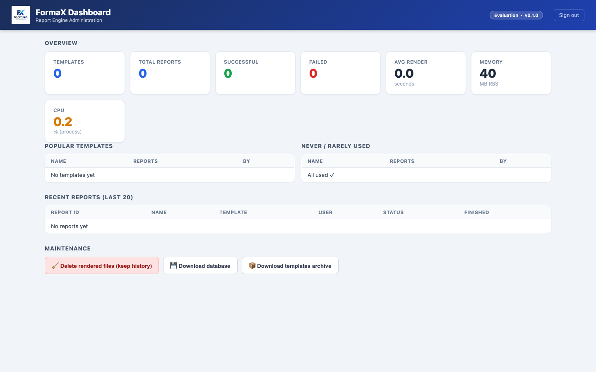

# FormaX Reporting Engine


I spent years relying on JasperReports Server. I loved what it could do —
but the report designer was a constant battle, and the resource footprint
made every deployment feel heavier than it needed to be.

So I built FormaX.

The idea is simple: **design your report template in Excel, exactly the way
it should look.** FormaX fills it with live data at request time and hands
back a finished file — no proprietary designer, no JVM, no dedicated report
server eating half your RAM.

I hope it solves the same problems for you that it solved for me.

---

## How it works

1. **Upload a template** — any `.xlsx` file you designed in Excel.
2. **Submit a report** — send a JSON payload with the data; get back a
   job ID immediately.
3. **Download the result** — poll for completion, then download the
   rendered `.xlsx`, `.pdf`, or `.html` file.

All three steps are REST API calls. No SDK, no agent, no special client
library needed.

---

## This is an Evaluation build

```
FormaX 0.1.0 — Asynchronous Excel Reporting Engine
Edition: Evaluation (no expiry date, max 5 concurrent report renders)
```

- **No time limit.** This build does not expire.
- **Concurrency capped at 5.** At most 5 reports render simultaneously;
  additional submissions wait in queue — none are rejected.

---

## Getting started

Read **`docs/DISTRIBUTION.md`** for installation instructions — bare-metal
(`.deb` + systemd) or Docker — and a walkthrough of the included example
template and sample payload.

Read **`docs/TEMPLATE_GUIDE.md`** for the full template authoring reference:
how to mark cells for single values, repeating rows, cross-tab matrices,
key-value blocks, headers/footers, page numbers, and multi-format output.

## Distribution layout

- `Dockerfile` + `formax-reporting-engine_<version>_amd64.deb` stay in the
  repository root so `docker build .` still works without extra flags.
- `docs/` contains customer-facing guides and image assets.
- `api/postman/` contains the ready-to-import Postman collection.
- `samples/templates-to-upload/` contains example `.xlsx` files to upload to
  `POST /templates`.
- `samples/payloads-to-generate/` contains example JSON payloads to submit to
  `POST /reports`.
- `samples/archives/samples.zip` contains the same sample files in archive
  form with the new folder layout.

---

## Environment variables

| Variable                          | Required           | Description                                                        |
| --------------------------------- | ------------------ | ------------------------------------------------------------------ |
| `REPORTING_JWT_SECRET`            | Yes                | Shared secret for API bearer-token auth. Use a long random string. |
| `REPORTING_LICENSE`               | For dashboard      | License JWT. Required to activate the management dashboard.        |
| `REPORTING_DASHBOARD_USERNAME`    | For dashboard      | Dashboard login username.                                          |
| `REPORTING_DASHBOARD_PASSWORD`    | For dashboard      | Dashboard login password.                                          |
| `REPORTING_WORKER_CONCURRENCY`    | No (default: 5)    | Maximum reports rendered in parallel.                              |
| `REPORTING_OUTPUT_RETENTION_DAYS` | No (default: 0)    | Days to keep generated output files. 0 = keep forever.             |
| `REPORTING_PORT`                  | No (default: 8000) | HTTP port.                                                         |

---

## API quick reference

All endpoints require a bearer token:

```
Authorization: Bearer <your-jwt>
```

Generate one with any HS256 JWT library using your `REPORTING_JWT_SECRET`.

**Templates**

| Method   | Path                     | What it does                                |
| -------- | ------------------------ | ------------------------------------------- |
| `POST`   | `/templates`             | Upload a new `.xlsx` template               |
| `GET`    | `/templates`             | List all templates                          |
| `GET`    | `/templates/{id}/sample` | Get a sample JSON payload for this template |
| `PUT`    | `/templates/{id}`        | Replace a template file (keeps the same ID) |
| `DELETE` | `/templates/{id}`        | Delete a template                           |

**Reports**

| Method | Path                     | What it does                                          |
| ------ | ------------------------ | ----------------------------------------------------- |
| `POST` | `/reports`               | Submit a report for rendering                         |
| `GET`  | `/reports/{id}`          | Poll job status (`QUEUED` → `PROCESSING` → `SUCCESS`) |
| `GET`  | `/reports/{id}/download` | Download the rendered file                            |

**System**

| Method | Path      | What it does                  |
| ------ | --------- | ----------------------------- |
| `GET`  | `/health` | Health check and edition info |

Import **`api/postman/FormaX-Reporting-Engine.postman_collection.json`** into
Postman for a ready-to-use collection with every endpoint pre-configured.

---

## Output formats

Set `"output_format"` in your report payload:

| Value    | Output                       |
| -------- | ---------------------------- |
| `"xlsx"` | Excel workbook (default)     |
| `"pdf"`  | PDF                          |
| `"html"` | HTML with all images inlined |

---

## Management dashboard



FormaX includes a web-based management dashboard: template usage stats,
job history, system metrics, housekeeping, and one-click backups.

**The dashboard is a licensed add-on** — it requires a license key to
activate (`REPORTING_LICENSE`). To enquire about dashboard access, open
an issue at:

**https://github.com/fried-ponbu/formax-report-engine/issues**
